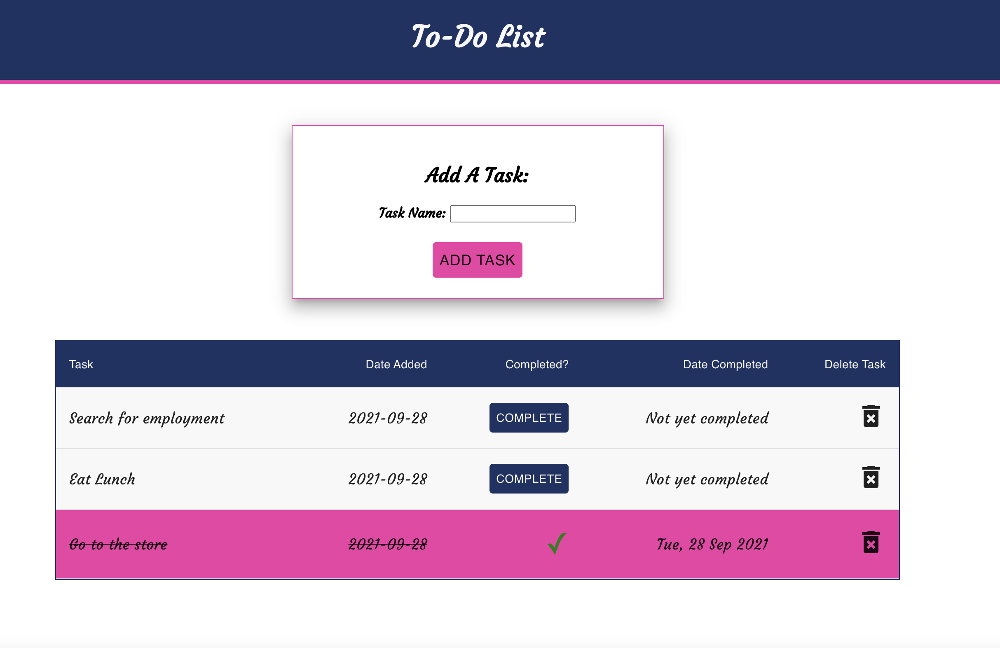

# React-Redux To-Do App Front-End

## Description

This application was built with React, Redux, and Material Ui. This is the front-end to a full CRUD application.
You have the ability to create, read, update and delete tasks. There will be a few different back-end applications in different languages that
will serve this application.

Back-End Applications associated with this application:
---

[Node/Express](https://github.com/jothoudt/backend-todo-node-express)   
[Python/Flask](https://github.com/jothoudt/python-to-do-backend)
[Java/Spring](https://github.com/jothoudt/spring-backend-todo) 

## To get started

- npm install

- npm start